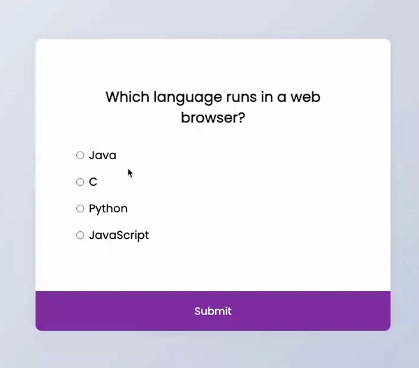

# Quiz App

This is a simple web-based quiz application built using HTML, CSS, and JavaScript. The quiz app presents the user with a series of multiple-choice questions, allows them to select answers, and provides instant feedback on the number of correct answers once they complete the quiz.

[Deployed link here](https://iqbalahmadi.github.io/Quiz-Application/)  

## Features

- Four multiple-choice questions.
- User-friendly interface.
- Instant feedback on the number of correct answers.
- Option to reload the questions and retake the quiz.

## Usage

1. Once you open the index.html file in your browser, you'll see the Quiz App interface with the first question and multiple-choice options.
2. Select your answer by clicking on one of the options.
3. Click the "Next" button to move to the next question.
4. Repeat steps 2 and 3 for all four questions.
5. After answering all questions, click the "Submit" button.
6. You will receive instant feedback on the number of correct answers out of 4.
7. If you wish to retake the quiz, simply click the "Reload" button to start over.
